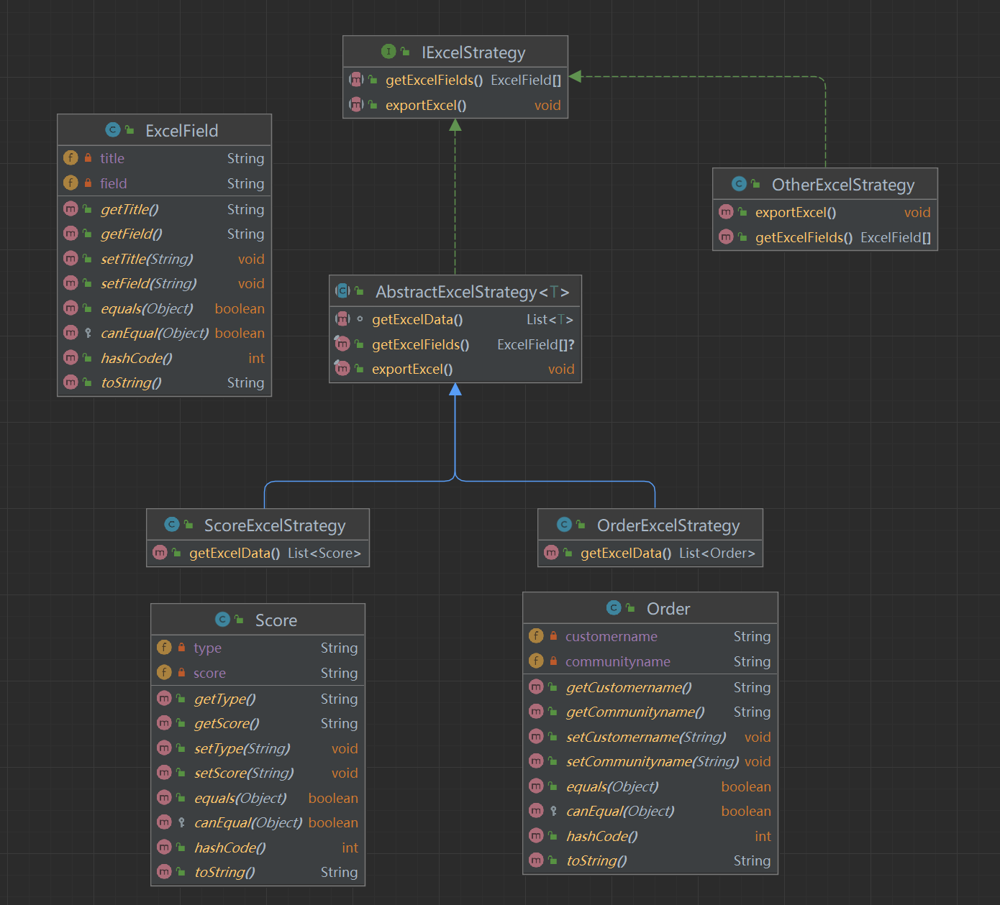
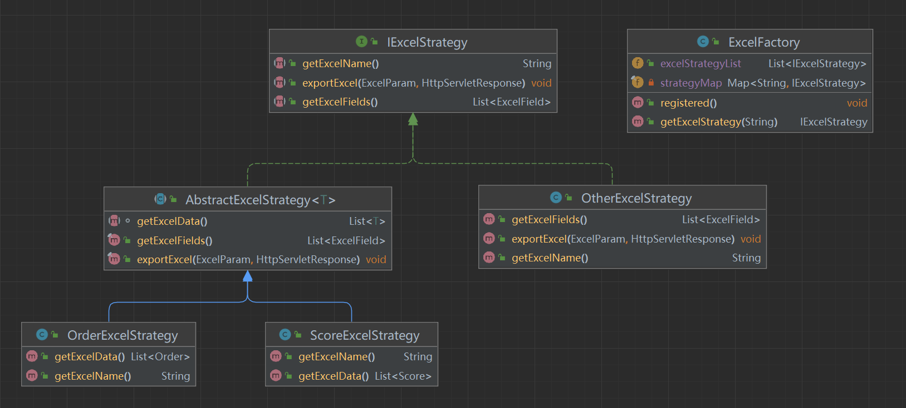
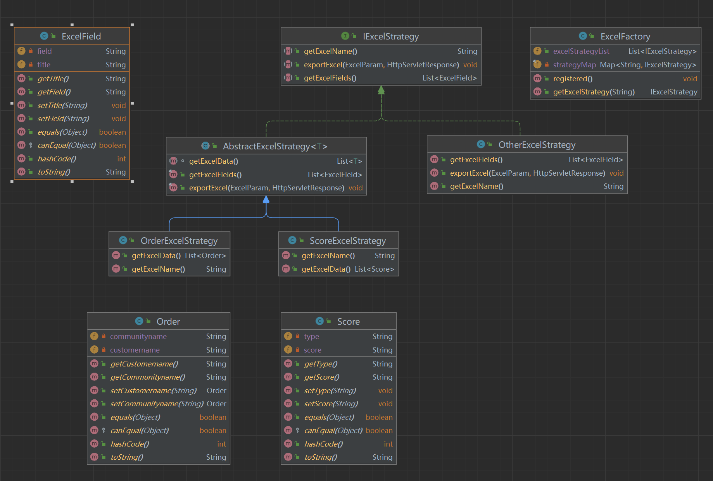
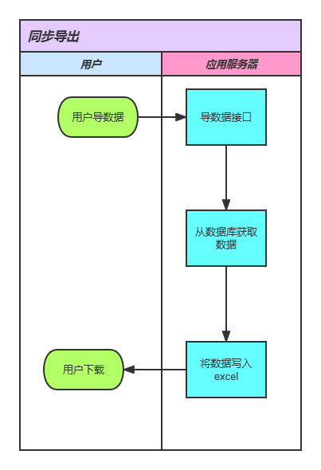
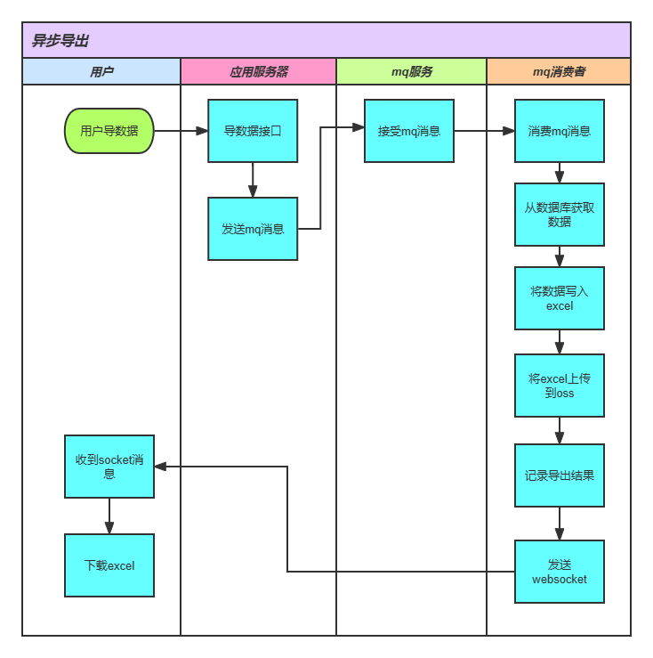
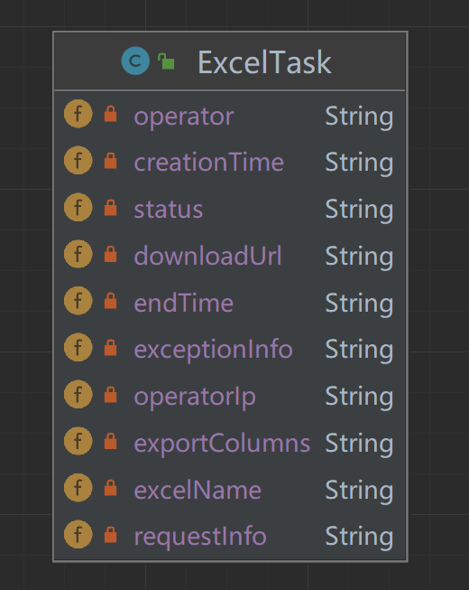

> 使用 `策略模式` 和 `Spring Aop` 2种方式，设计通用导出方案，导出demo使用 [EasyExcel](https://easyexcel.opensource.alibaba.com/) 

# 通过策略模式

## 定义导出策略

> 使用 模版方法 加 策略模式




* excel 字段映射
```java
@Data
public class ExcelField {

    /**
     * 导出的标题
     */
    private String title;

    /**
     * 导出的字段名
     */
    private String field;
}
```

* 工单实体
```java
@Data
public class Order {
  @ExcelProperty("客户名称")
  private String customername;

  @ExcelProperty("小区名称")
  private String communityname;
}
```

* 积分实体
```java
public class Score {
  @ExcelProperty("积分类型")
  private String type;

  @ExcelProperty("兑换积分")
  private String score;
}
```

> 在 接口中 定义方法

```java
public interface IExcelStrategy {
  /**
   * 获取excel字段
   */
  List<ExcelField> getExcelFields();

  /**
   * 导出excel
   */
  void exportExcel(ExcelParam param, HttpServletResponse response);
}
```

> 在抽象类中，定义导出基本流程
>
> 1. `getExcelData`: 获取需要导出的excel数据的方法，由各个导出策略继承实现
> 2. `exportExcel`: 将获取到的数据导出为excel，为通用方法，用`final`关键字代表不允许子类重写
> 3. `getExcelFields`: 获取导出数据的表头字段映射，为通用方法，用`final`关键字代表不允许子类重写

```java
public abstract class AbstractExcelStrategy<T> implements IExcelStrategy {

  abstract List<T> getExcelData();

  @Override
  public final void exportExcel(ExcelParam param, HttpServletResponse response) {
    List<T> excelData = getExcelData();
    // 处理需要导出的字段
    System.out.println("需要导出的字段: " + Arrays.toString(param.getFields()));

    try {
      // 具体导出excel的逻辑
      // 获取泛型的class
      ParameterizedType type = (ParameterizedType) this.getClass().getGenericSuperclass();
      Class<?> TClass = (Class<?>) type.getActualTypeArguments()[0];
      EasyExcel.write(response.getOutputStream(), TClass).sheet("模板").doWrite(excelData);
    } catch (IOException e) {
      e.printStackTrace();
    }
  }

  @Override
  public final List<ExcelField> getExcelFields() {
    // 获取泛型的class
    ParameterizedType type = (ParameterizedType) this.getClass().getGenericSuperclass();
    Class<?> TClass = (Class<?>) type.getActualTypeArguments()[0];

    List<ExcelField> excelFields = new ArrayList<>();

    // 获取所有字段
    Field[] fields = TClass.getDeclaredFields();

    for (Field field : fields) {
      if (field.isAnnotationPresent(ExcelProperty.class)) {
        System.out.println(field.getName());
        ExcelProperty excelProperty = AnnotationUtils.findAnnotation(field, ExcelProperty.class);
        excelFields.add(new ExcelField(excelProperty == null ? "" : excelProperty.value()[0], field.getName()));
      }
    }

    return excelFields;
  }
}
```

> 具体的导出策略，例如导出订单

```java
public class OrderExcelStrategy extends AbstractExcelStrategy<Order> {
  @Override
  public List<Order> getExcelData() {
    // 获取excel数据
    List<Order> orderExcelData = new ArrayList<Order>();

    orderExcelData.add(new Order("小区1", "客户1"));
    orderExcelData.add(new Order("小区2", "客户2"));

    return orderExcelData;
  }
}
```

> 需要自定义导出功能扩展，直接实现 `IExcelStrategy` 接口

```java
public class OtherExcelStrategy implements IExcelStrategy {

    @Override
    public List<ExcelField> getExcelFields() {
        // 自定义获取 excel 字段
        return null;
    }

    @Override
    public void exportExcel(ExcelParam param, HttpServletResponse response) {
        // 获取 excel 数据
        String data = "其他Excel数据";

        System.out.println("导出字段: " + param.getExcelName());

        // 导出excel
        System.out.println("导出数据: " + data);
    }
}
```


---

## 工厂模式加自动装配

> 新增`getExcelName`,为每一个策略设置名称，用于区分策略

```java
public interface IExcelStrategy {

  /**
   * 获取excel名称
   */
  String getExcelName();

  /**
   * 获取excel字段
   */
  List<ExcelField> getExcelFields();

  /**
   * 导出excel
   */
  void exportExcel(ExcelParam param, HttpServletResponse response);
}
```


> 使用工厂（ExcelFactory）管理 excel策略
>
> excel 工厂，通过 `spring` 自动装配各个 `excel` 策略

```java
@Component
public class ExcelFactory {
    @Resource
    public List<IExcelStrategy> excelStrategyList;

    private final Map<String, IExcelStrategy> strategyMap = new HashMap<>();

    @PostConstruct
    public void registered() {
        /**
         * 通过excelName来区分不同的策略，通过 spring 将所有的策略注入到 strategyMap 中
         */
        excelStrategyList.forEach(strategy -> strategyMap.put(strategy.getExcelName(), strategy));
    }

    public IExcelStrategy getExcelStrategy(String excelName) {
        if (!strategyMap.containsKey(excelName)) {
            throw new RuntimeException("excelStrategy not found");
        }

        return strategyMap.get(excelName);
    }
}
```




> 整体 uml 图



> controller

```java
@RequestMapping("/strategy")
@RestController
public class StrategyExcelController {

  @Resource
  private ExcelFactory excelFactory;

  /**
   * 获取 excel fields
   */
  @GetMapping("/fields")
  public List<ExcelField> getExcelFields(String excelName) {
    List<ExcelField> excelFields = excelFactory.getExcelStrategy(excelName).getExcelFields();
    return excelFields;
  }

  /**
   * 导出 excel
   */
  @PostMapping("/export")
  public void exportExcel(@RequestBody ExcelParam param, HttpServletResponse response) {
    excelFactory.getExcelStrategy(param.getExcelName()).exportExcel(param, response);
  }
}
```

> 前端 fetch 测试导出

```js
fetch('http://localhost:8080/strategy/export', {
  method: 'post',
  headers: {
    'content-type': 'application/json',
  },
  responseType: 'blob',
  body: JSON.stringify({
    excelName: 'SCORE_EXCEL',
    fields: ['id', 'name'],
  }),
}).then((res) => {
  console.log(res)

  return res.blob()
}).then((blob) => {
  const bl = new Blob([blob])
  const fileName = '文件名' + '.xlsx'
  const link = document.createElement('a')
  link.href = window.URL.createObjectURL(blob)
  link.download = fileName
  link.click()
  window.URL.revokeObjectURL(link.href)
})
```


---

# 通过AOP实现

> 定义 aop 导出

```java
@Aspect
@Component
@Slf4j
public class ExcelAop {

  @Around(value = "@annotation(excelExport)")
  public Object around(ProceedingJoinPoint joinPoint, ExcelExport excelExport) throws Throwable {

    Object[] args = joinPoint.getArgs();
    HttpServletResponse response = null;
    ExcelParam excelParam = null;

    for (Object arg : args) {
      if (arg instanceof HttpServletResponse) {
        response = (HttpServletResponse) arg;
      } else if (arg instanceof ExcelParam) {
        excelParam = (ExcelParam) arg;
      }
    }

    if (response == null || excelParam == null) {
      throw new RuntimeException("HttpServletResponse 或 ExcelParam 不存在");
    }

    response.setCharacterEncoding("utf-8");

    if (ExportType.COLUMN.equals(excelParam.getExportType())) {
      // 返回 excel 列名
      List<ExcelField> excelFields = getExcelFields(excelExport);
      response.getWriter().write("该excel列名为: " + excelFields.toString());
    } else {
      // 具体导出excel的逻辑
      List<?> excelData = (List<?>) joinPoint.proceed();
      EasyExcel.write(response.getOutputStream(), excelExport.value()).sheet("模板").doWrite(excelData);
    }

    return null;
  }

  private List<ExcelField> getExcelFields(ExcelExport excelExport) {
    Class<?> clazz = excelExport.value();
    Field[] fields = clazz.getDeclaredFields();

    List<ExcelField> excelFields = new ArrayList<>();

    for (Field field : fields) {
      if (field.isAnnotationPresent(ExcelProperty.class)) {
        ExcelProperty excelProperty = AnnotationUtils.findAnnotation(field, ExcelProperty.class);
        String title = excelProperty == null ? "" : excelProperty.value()[0];
        String name = field.getName();

        excelFields.add(new ExcelField(title, name));
      }
    }

    return excelFields;
  }
}
```

> controller 中使用

```java
@RestController
@RequestMapping("/aop")
public class AopExcelController {
  /**
   * 导出 excel
   */
  @PostMapping("/export")
  @ExcelExport(Order.class)
  public List<Order> exportExcelAop(@RequestBody ExcelParam param, HttpServletResponse response) {

    // 模拟从数据库中获取数据
    List<Order> orderExcelData = new ArrayList<Order>();
    orderExcelData.add(new Order("小区1", "客户1"));
    orderExcelData.add(new Order("小区2", "客户2"));

    return orderExcelData;
  }
}
```

> 前端 fetch 导出测试

```js
fetch('http://localhost:8080/aop/export', {
  method: 'post',
  headers: {
    'content-type': 'application/json',
  },
  responseType: 'blob',
  body: JSON.stringify({
    excelName: 'SCORE_EXCEL',
    fields: ['id', 'name'],
    exportType : 'DATA'
  }),
}).then((res) => {
  return res.blob()
}).then((blob) => {
  const bl = new Blob([blob])
  const fileName = '文件名' + '.xlsx'
  const link = document.createElement('a')
  link.href = window.URL.createObjectURL(blob)
  link.download = fileName
  link.click()
  window.URL.revokeObjectURL(link.href)
})
```


---

# 导出流程

## 同步导出
1. 导出时间过长，用户体验不好，容易导致超时，
2. 不可控，月底大量导出任务，把所有数据一次性装载到内存，容易引起内存溢出



## 异步导出
1. 用户导出数据，将导出任务放入消息队列，实现异步导出
2. 通过消息队列，管理导出的任务，避免导出任务过多，导致内存溢出
3. 记录导出任务，便于后期排查导出问题
4. 通过消息通知，告知用户导出结果




> 导出记录表



